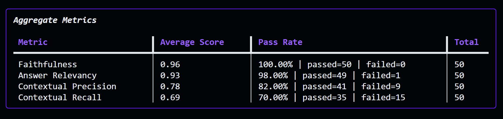
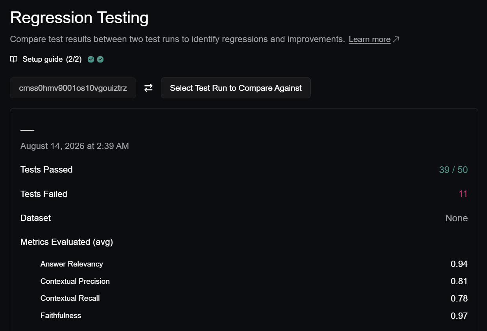
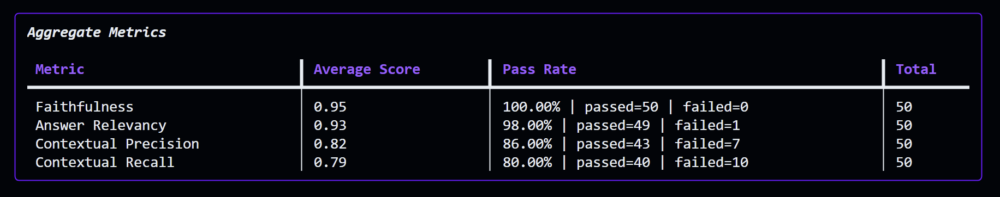
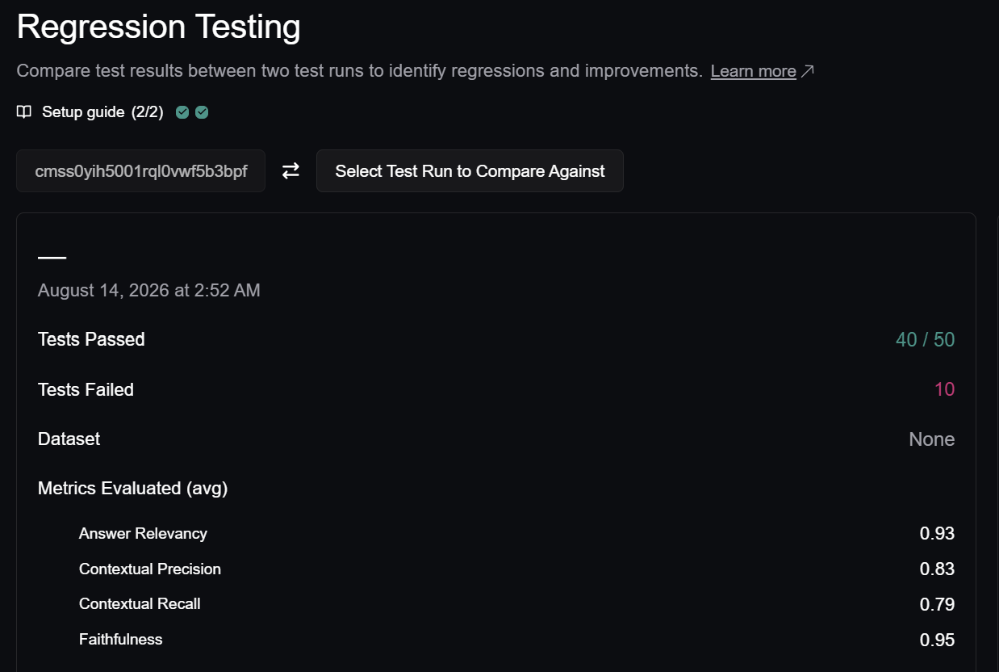

# 🛡️ HR RBAC RAG — Enterprise Multi-Tenant RAG with Role-Based Access Control

An enterprise-grade Retrieval-Augmented Generation (RAG) system featuring **Multi-Role RBAC security isolation**, **Dense + Hybrid Vector Retrieval**, and comprehensive CI/CD evaluation powered by **DeepEval & Groq**.

---

## 📊 Evaluation Benchmarks (50 Q&A Test Cases)

### 📈 Stage 1: Dense Semantic Search (Baseline)
*Dense vector embeddings (`BAAI/bge-small-en-v1.5`) with cosine similarity & RBAC filtering.*

| Metric | Average Score | Pass Rate | Evaluation Result |
|---|:---:|:---:|---|
| **Faithfulness** | **0.97** | **100.00%** (50/50 passed) | 🟢 Flawless factual grounding in retrieved context |
| **Answer Relevancy** | **0.94** | **100.00%** (50/50 passed) | 🟢 Highly pertinent answers aligned with query |
| **Contextual Precision** | **0.81** | **86.00%** (43/50 passed) | 🟡 Signal-to-noise ratio baseline |
| **Contextual Recall** | **0.78** | **78.00%** (39/50 passed) | 🟡 Missed exact keyword and policy numbers |
| **RBAC Security Isolation** | **1.00** | **100.00%** (28/28 passed) | 🛡️ Zero cross-role data leaks |

**Stage 1 Summary**: **78.00% PASSED** (39/50) | **22.00% FAILED** (11/50)

<p align="center">
  
  
</p>

---

### 📈 Stage 2: Hybrid Search (Dense BGE-Small + Sparse BM25 + RRF)
*Added BM25 Sparse embeddings with IDF weighting + Reciprocal Rank Fusion (RRF).*

| Metric | Average Score | Pass Rate | Evaluation Result |
|---|:---:|:---:|---|
| **Faithfulness** | **0.95** | **100.00%** (50/50 passed) | 🟢 Flawless factual grounding in retrieved context |
| **Answer Relevancy** | **0.93** | **98.00%** (49/50 passed) | 🟢 Highly pertinent answers aligned with query |
| **Contextual Precision** | **0.82** | **86.00%** (43/50 passed) | 🟢 **+0.01 score gain** from BM25 sparse keyword ranking |
| **Contextual Recall** | **0.79** | **80.00%** (40/50 passed) | 🟢 **+2.00% boost** in retrieving exact policy terms |
| **RBAC Security Isolation** | **1.00** | **100.00%** (28/28 passed) | 🛡️ Zero cross-role data leaks |

**Stage 2 Summary**: **80.00% PASSED** (40/50) | **20.00% FAILED** (10/50)

<p align="center">
  
  
</p>

---

### 📊 Benchmark Progression: Stage 1 vs Stage 2

| Metric | Stage 1 (Dense Baseline) | Stage 2 (Hybrid BM25 + Dense) | Delta / Improvement |
|---|:---:|:---:|:---:|
| **Contextual Precision** | 0.81 (86.00% pass) | **0.82 (86.00% pass)** | 🟢 **+0.01 avg score boost** |
| **Contextual Recall** | 0.78 (78.00% pass) | **0.79 (80.00% pass)** | 🟢 **+2.00% (+1 passed test case)** |
| **Faithfulness** | 0.97 (100.00% pass) | **0.95 (100.00% pass)** | 🛡️ **100.00% Pass Maintained (50/50)** |
| **Answer Relevancy** | 0.94 (100.00% pass) | **0.93 (98.00% pass)** | 🟢 **High Relevancy Maintained (49/50)** |
| **RBAC Isolation** | 1.00 (100.00% pass) | **1.00 (100.00% pass)** | 🛡️ **100.00% Maintained (28/28)** |
| **Overall Pass Rate** | **78.00%** (39/50) | **80.00%** (40/50) | 🚀 **+2.00% Overall System Gain** |

---

## 🏗️ Architecture Overview

- **Vector Database**: Qdrant (Local on-disk vector store with payload index partitioning)
- **Hybrid Retrieval Engine**:
  - **Dense Embeddings**: `BAAI/bge-small-en-v1.5` via FastEmbed (384-dim semantic vectors)
  - **Sparse Embeddings**: `Qdrant/bm25` via FastEmbedSparse (IDF term-frequency weighting)
  - **Fusion Strategy**: Native Qdrant Reciprocal Rank Fusion (RRF)
- **Generation Model**: Llama 3.3 70B Versatile via ChatGroq
- **Evaluation Judge**: Groq SDK with native structured JSON output
- **Multi-Role RBAC**: Strict payload filtering isolating documents across:
  - `Employee` (General policies, benefits, handbook)
  - `HR Manager` (Performance reviews, grievance SLAs, PIP roadmaps)
  - `Payroll Officer` (Salary bands, bonus payouts, tax slabs)
  - `Ops Lead` & `Executive` (Operational SLAs, enterprise audits)
  - `Admin` (Unrestricted access)

---

## 🚀 Quickstart

### 1. Installation
```powershell
uv sync
```

### 2. Environment Setup
Create a `.env` file based on `.env.example`:
```env
GROQ_API_KEY=gsk_your_groq_key
GROQ_MODEL=llama-3.3-70b-versatile
QDRANT_PATH=./qdrant_db
COLLECTION_NAME=pdf_rag
```

### 3. Ingest Enterprise Documents (Hybrid Dense + BM25)
```powershell
uv run python scripts/generate_enterprise_pdfs.py
uv run python -m src.ingester
```

### 4. Run Benchmark Evaluation (50 Q&A Pairs)
```powershell
uv run python benchmark.py 50
```

### 5. Launch Streamlit UI
```powershell
uv run streamlit run app.py
```
